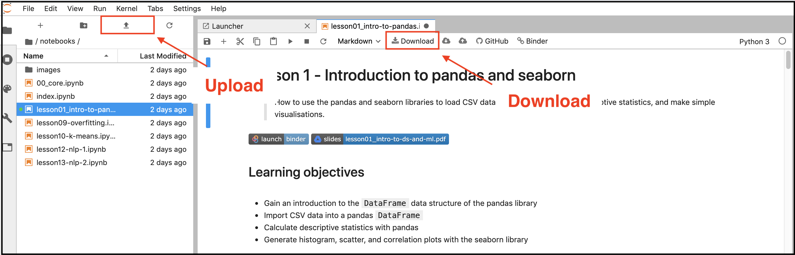

# Introduction to Data Science
> Welcome to the course materials for BTW2401 - Data Science and Visualisation!


Here you can find the course materials for the Data Science course taught at the Bern University of Applied Sciences by Lewis Tunstall and Leandro von Werra in 2020.

## What is this thing called data science?

Data science is a big deal in business these days, and with good reasons. Amongst them (Loukides, 2010):
* Almost every aspect of a business is open to data collection, be it web server logs, tweet streams, IoT sensors, online transactions, or some other source. Data science provides techniques to extract useful information from this data and thus generate added value;
* The question facing every company, startup, and non-profit that wants to attract a community in the modern era is how to use data _effectively._ Using data effectively requires something different from traditional statistics; namely an interdisciplinary approach that involves elements of statistics, computer science, and domain expertise. Data science is the methodology that synthesises these three domains.

In essence, data science is about the extraction of useful information and knowledge from
large volumes of data, in order to improve business decision-making (Provost & Fawcett, 2013). With improved decision making comes improved productivity, market value, and competitive edge. Thus the main goal of data science is to enable data-driven decision making across the whole company, where decisions are based on the analysis of data rather than pure intuition.

There are many challenges involved with making data science an effective component of a business, but for those that succeed (Google, Amazon, Facebook, LinkedIn) the rewards are immense.

<div style="text-align: center">

<p style="text-align: center;"> <b>Figure:</b> Data science in the context of various data-related processes in the organization (Provost and Fawcett, 2013). </p>
</div>

## Learning objectives of the course
This module provides students with a _hands-on_ introduction to the methods of data science, with an emphasis on applying these methods to solve business problems. By the end of this course, it is expected that students will:

* Know how to approach business problems from a data science perspective;
* Understand the fundamental principles behind extracting useful knowledge from data; 
* Understand the core concepts and terminology of machine learning;
* Gain hands-on experience with mining data for insights.

Throughout the course, students will also have the opportunity to learn several technical skills:

* Python programming and experience with the core libaries for data analysis, visualisation, and modelling.
* Working with data: collecting, cleaning, and transforming.
* Creating and interpreting descriptive statistics.
* Creating and interpreting data visualisations.
* Practical experience with machine learning.

## Structure of the module
The module structure consists of classroom sessions, self-study tasks, and group work. The classroom sessions will involve a mix of theoretical and practical (programming) work, with an emphasis on the latter. The self-study tasks will be used to read selected chapters from the module textbook. The outline for the module is shown in the table below. 

| CW | Date | Topic | Links |
| :--- | :--- | :--- | :--- |
| 8 | 20.02 | Introduction to data science | [](https://mybinder.org/v2/gh/lewtun/dslectures/master?urlpath=lab/tree/notebooks/lesson01_intro-to-pandas.ipynb) [](https://raw.githubusercontent.com/lewtun/dslectures/master/notebooks/lesson01_intro-to-pandas.ipynb) [](https://drive.google.com/file/d/14bPRdbbf_CjDOfG8rBbSBQO-dDpxDj2G/view) |
| 9 | 27.02 | Exploratory data analysis | [](https://mybinder.org/v2/gh/lewtun/dslectures/master?urlpath=lab/tree/notebooks%2Flesson02_exploratory-data-analysis.ipynb) [](https://raw.githubusercontent.com/lewtun/dslectures/master/notebooks/lesson02_exploratory-data-analysis.ipynb) [](https://drive.google.com/open?id=1o7zrt0wB5XeJp1r16hv2dUVQVQEVAygl)  |
| 10 | 5.03 | Data cleaning and feature engineering | [](https://mybinder.org/v2/gh/lewtun/dslectures/master?urlpath=lab/tree/notebooks%2Flesson03_data-cleaning.ipynb) [](https://raw.githubusercontent.com/lewtun/dslectures/master/notebooks/lesson03_data-cleaning.ipynb) [](https://drive.google.com/open?id=1qif0v7ZclsCsjT1efrCAjjUTqZ_KyTIl) |
| 11 | 12.03 | Introduction to random forests | [](https://mybinder.org/v2/gh/lewtun/dslectures/master?urlpath=lab/tree/notebooks%2Flesson04_intro-to-random-forests.ipynb)  [](https://raw.githubusercontent.com/lewtun/dslectures/master/notebooks/lesson04_intro-to-random-forests.ipynb) [](https://drive.google.com/open?id=18yESZldXJrdXiaOQWmiA35-8vIqOnNK8) |
| 12 | 19.03 | Random forest deep dive | [](https://mybinder.org/v2/gh/lewtun/dslectures/master?urlpath=lab/tree/notebooks%2Flesson05_random-forest-deep-dive.ipynb) [](https://raw.githubusercontent.com/lewtun/dslectures/master/notebooks/lesson05_random-forest-deep-dive.ipynb) [](https://drive.google.com/open?id=1xRpRXFY_wMzHn2QgW3nDzULh8Y7G5IVt) |
| 13 | 26.03 | Model interpretation | [](https://mybinder.org/v2/gh/lewtun/dslectures/master?urlpath=lab/tree/notebooks%2Flesson06_model-interpretation.ipynb) [](https://raw.githubusercontent.com/lewtun/dslectures/master/notebooks/lesson06_model-interpretation.ipynb) [](https://drive.google.com/open?id=15IIYC_MksmXI6VfSL3ee-rLm7TRF0v2U) |
| 14 | 2.04 | Classification | [](https://mybinder.org/v2/gh/lewtun/dslectures/master?urlpath=lab/tree/notebooks%2Flesson07_classification.ipynb) [](https://raw.githubusercontent.com/lewtun/dslectures/master/notebooks/lesson07_classification.ipynb) [](https://drive.google.com/open?id=12gVqkVJ9KIaBGPCq0auFxXOPlEdo9Dik) |
| 15 | 9.04 | **No class (Easter)** | |
| 16 | 16.04 | **Define group projects** | [](https://mybinder.org/v2/gh/lewtun/dslectures/master?urlpath=lab/tree/notebooks%2Flesson08_group-project.ipynb) [](https://raw.githubusercontent.com/lewtun/dslectures/master/notebooks/lesson08_group-project.ipynb) [](https://drive.google.com/open?id=1F8QEELcst-lPPIwhEVQYy8UGFOdlv1gA)|
| 17 | 23.04 | Cross-validation and model performance |[](https://mybinder.org/v2/gh/lewtun/dslectures/master?urlpath=lab/tree/notebooks%2Flesson09_overfitting.ipynb) [](https://raw.githubusercontent.com/lewtun/dslectures/master/notebooks/lesson09_overfitting.ipynb) [](https://drive.google.com/open?id=1xH2FnIzrrub1ZJmyJAhYrUOyhJ5ov13x) |
| 18 | 30.04 | Neighbours and clusters | [](https://mybinder.org/v2/gh/lewtun/dslectures/master?urlpath=lab/tree/notebooks%2Flesson10_clusters.ipynb) [](https://raw.githubusercontent.com/lewtun/dslectures/master/notebooks/lesson10_clusters.ipynb) [](https://drive.google.com/open?id=1PZ_Yh3nK1qLVJoLBAc5nMpd2wyFQKKX8) |
| 19 | 7.05 | Dimensions and visualisation| [](https://mybinder.org/v2/gh/lewtun/dslectures/master?urlpath=lab/tree/notebooks%2Flesson11_visualisation.ipynb) [](https://raw.githubusercontent.com/lewtun/dslectures/master/notebooks/lesson11_visualisation.ipynb) [](https://drive.google.com/open?id=1zEGTza7zgBY6bDUxW6spcgr5InYY3Fub)|
| 20 | 14.05 | Natural language processing I | [](https://mybinder.org/v2/gh/lewtun/dslectures/master?urlpath=lab/tree/notebooks%2Flesson12_nlp-intro.ipynb) [](https://raw.githubusercontent.com/lewtun/dslectures/master/notebooks/lesson12_nlp-intro.ipynb) [](https://drive.google.com/open?id=11m5iXGNJEUlvjSMLdQAztJyVZ2LLj4oz) |
| 21 | 21.05 | **No class (Ascension)** | |
| 22 | 28.05 | Natural language processing II **& group project submission** |[](https://colab.research.google.com/github/lewtun/dslectures/blob/master/notebooks/lesson13_nlp-deep.ipynb)[](https://raw.githubusercontent.com/lewtun/dslectures/master/notebooks/lesson13_nlp-deep.ipynb)[](https://drive.google.com/open?id=1g613_b3643zUuPVB1JBBuyxXka_WRRWF)|
| 23 | 4.06 | **Project presentations** |[](https://mybinder.org/v2/gh/lewtun/dslectures/master?urlpath=lab/tree/notebooks%2Flesson14_image-dataset.ipynb) [](https://raw.githubusercontent.com/lewtun/dslectures/master/notebooks/lesson14_image-dataset.ipynb)[](https://drive.google.com/open?id=16cPFIu-tmZ8Op8awMvIiXi-vcMbTmleu)|
| 24 | 11.06 | Deep learning |[](https://colab.research.google.com/github/lewtun/dslectures/blob/master/notebooks/lesson15_cv-deep.ipynb) [](https://raw.githubusercontent.com/lewtun/dslectures/master/notebooks/lesson15_cv-deep.ipynb) [](https://drive.google.com/open?id=1-e9BU8_TwD02lYcs66lDNkhsiqu2dZ1R)|
| 25 | 18.06 | Exam preparation| |
| 26 | 25.06 | Exam preparation | |
| 27 | TBC | **Final exam** | |

**Note:** To download the notebooks, right-click on the badge  and select "Save Link as ..." and make sure to save them with the `.ipynb` ending.

## Cloud environment
We will be teaching most of the class via Jupyter notebooks in Python. The notebooks for each class will be made available from links on this website. Note that some parts of the notebooks are removed for you to fill in as you follow along in class. You can open and run them directly on Binder by clicking on the Binder badge (see example below) at the top of each lecture notebook. We highly encourage the use of Binder, since it requires no local installation and runs for free. 

Binder badge:   

A few remarks about Binder:

1. Binder is free to use.
2. If you edit a notebook make sure you _**download it**_, since Binder _**does not save your changes.**_
3. Binder will automatically shut down user sessions that have more than 10 minutes of inactivity (if you leave your browser window open, this will be counted as “activity”).
4. Binder aims to provide at least 12 hours of session time per user session. Beyond that, it is not guaranteed that the session will remain running.


### Downloading and uploading files
Since Binder does not save your changes permanently, you should download the notebooks you worked on at the end of your session. If you want to continue your session later on you can re-upload them to Binder. See the image below for instructions how to upload and download files.

<div style="text-align: center">

<p style="text-align: center;"> <b>Figure:</b> Download and upload buttons on JupyterLab as seen in the binder environment. </p>
</div>

## Local environment
You can also install the data science lecture material locally on your laptop. In general, when working with Python it is recommended to use [virtual environments](https://docs.python.org/3/tutorial/venv.html). This makes sure that the packages you install don't interfere with the packages you already installed in other projects.

To install the data science lectures library run the following command:

```bash
pip install dslectures
```

To install JupyterLab (a more advanced environment than Jupyter notebooks) run:

```bash
pip install jupyterlab
```
Then make sure you download all course material from the [GitHub repository](https://github.com/lewtun/dslectures) or just the missing notebooks. In general you will need to copy all materials, since some resources such as images are not self-contained in the notebooks.

Finally, to start JuypterLab run:
```bash
jupyter-lab
```

### Updating the local environment
Since we are developing the materials throughout the course you will need to update your local environment every time we move on to the next lesson. To do so just run the following command before you start JupyterLab

```bash
pip install --upgrade dslectures
```

## Module policies 

**Before class**

We expect students to prepare for each class by completing the self-study tasks in advance.

**During class**

Please refrain from using your phone or social media (Facebook, Twitter, etc) during class; we do however encourage you to use the class Slack group! We also expect students to take an active role during the class by asking questions and contributing to the discussions.

**Academic integrity and honesty**

Your answers to homework, quizzes, and exams must be your own work (except for the group project, which is a collaborative task). Please don’t cheat or plagiarise other people’s work.

## Assessment

**Update:** Due to the COVID-19 pandemic, we have decided to remove the mid-term test from the assessment and allocate the 10 points to the group project.

The assessment for this module involves **_two_** parts whose sum is 100 points: one group project (50 points), and one final written exam (50 points). The total number of points determines the overall grade for the module.

1. **Group project:** Students will be allocated into small groups and tasked to solve an end-to-end data science project. The results from the analysis must be submitted in the form of a Jupyter notebook, followed by a 15 minute oral presentation to the class. The maximum score for this assessment is 50 points, evenly distributed across the analysis code (25 points) and presentation (25 points).
2. **Written examination:** The final written examination will consist of multiple choice and short answer questions, covering the content of the lectures and the module textbook. Students will not be required to solve any Python programming questions in the exam. The exam has a maximum score of 50 points and the final date will lie somewhere between June 29th and July 17th.

## Recommended references

**Data Science**
* F. Provost and T. Fawcett, _Data Science for Business,_ (O’Reilly Media 2013). 
* J. VanderPlas, [_Python for Data Science Handbook,_](https://jakevdp.github.io/PythonDataScienceHandbook/) (O’Reilly Media 2016).

Provost & Fawcett will be used as the **_primary_** textbook for the module and is the standard data science text for business programs at over 150 universities around the world. The book by VanderPlas is an excellent reference for the Python programming aspects of the module.

**Python Programming**
* W. McKinney, _Python for Data Analysis,_ 2nd ed (O’Reilly Media 2017).

We will use the Python programming language to analyse and visualise a variety of datasets in this module. McKinney’s book is an excellent reference to have at hand and covers the nuts and bolts of the NumPy and pandas packages.

**Machine Learning**
* A. Géron, _Hands-On Machine Learning with Scikit-Learn and TensorFlow,_ (O’Reilly Media 2017).
* J. Howard, _Introduction to Machine Learning for Coders,_ (fastAI 2018).

Although machine learning is not the only focus of this course, Géron’s book or fastAI’s MOOC provide the right level of technical detail to gain a deeper understanding of this exciting field.

**Kaggle Learn**
* [Kaggle Learn](https://www.kaggle.com/learn/overview)

Kaggle Learn is a great resource to brush up on concepts like Python basics, data visualisation or pandas in an online notebook environment (similar to Binder).

##  Sources used for this syllabus
* M. Loukides, _What is Data Science?,_ (O’Reilly 2010). Retrieved from https://www.oreilly.com/ideas/what-is-data-science
* D. Conway, _The Data Science Venn Diagram,_ (2010). Retrieved from http://drewconway.com/zia/2013/3/26/the-data-science-venn-diagram
